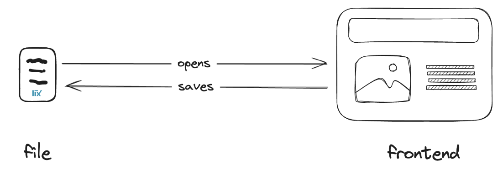
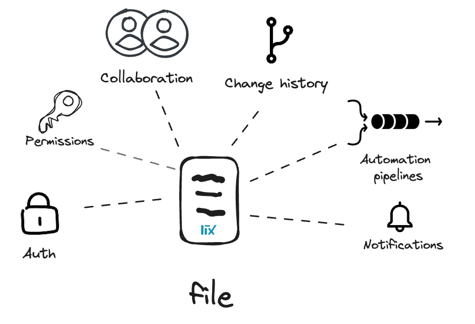
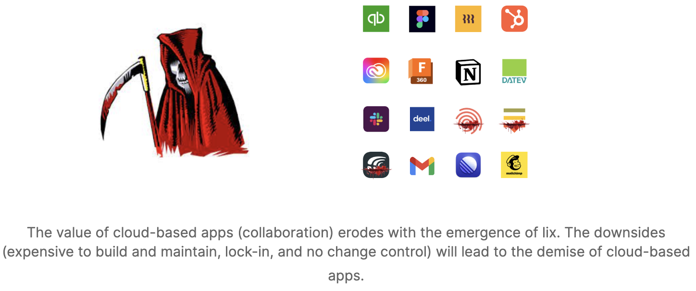
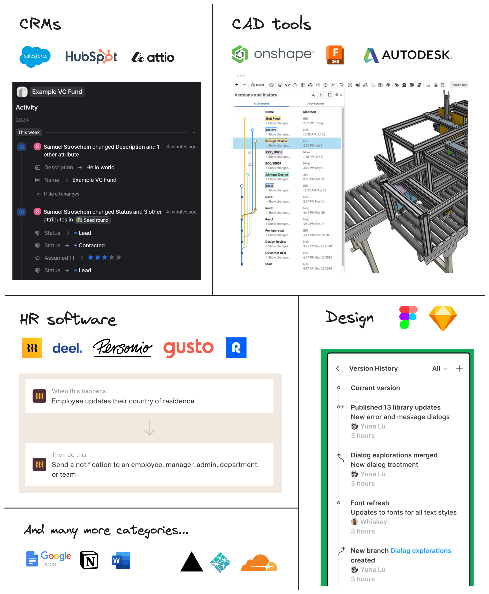

# Lix

Lix is a change control system that runs in the browser and an SDK to build web apps.  

A change control system allows storing, tracking, querying, and reviewing changes in different file formats, e.g., `.xlsx`, `.sqlite`, or `.inlang`. Compared to a version control system, a change control system understands “what” changed in a file, e.g., cell C43 in the financials spreadsheet changed. 

The SDK allows building web apps on top of change control, such as cloning repositories into the browser, reading and writing files, query changes, triggering automations, or performing remote (edge) computations. In short, the lix SDK is a backend for web applications.

Check out the [design principles](./documentation/design-principles.md).

## The Lix SDK is an easier way to build collaborative apps

Developing a web app with lix is reduced to providing a user interface that opens and saves a file.

Backend features like auth, permissions, change control, and automations are solved on a file rather than an application-specific level. Lix knows who the actors are (auth), allows actors to conduct changes (permissions), is aware of how data changes over time (change history), can merge changes (collaboration), and uses the knowledge of changes to trigger automations (automation pipelines).

In contrast, cloud-based apps are substantially more difficult to build because they require:

- Auth (could be solved with a backend as a service)
- Integrations (no interop between apps)
- Ensure data privacy and security
- Scaling complexity of storing all customer data 
- Replicating change control features like history, branching, etc.

## Lix apps are more capable than cloud-based apps

### Interop

Lix apps operate on (open) files. Any app can open the files and process the data. The need for integrations that transfer data from cloud app A to cloud app B is redundant. App 1 and app 2 can provide different UIs or services while operating on the same data. 

We use lix’s interoperability between apps for the inlang ecosystem. Every app fulfills a different job for a different persona when globalizing software. Yet, because all apps are interoperable, every team member can collaborate across those different apps. 

Here is a demo video https://www.youtube.com/watch?v=b5EWVgQP3R0 

### Permissionless (open source) collaboration

Lix brings branches and change requests, thereby enabling permissionless collaboration in file formats other than source code. We will see an “open-sourceification” of music, video, architecture, public policy making, fashion, and who knows, maybe even automobiles.  

Permissionless collaboration refers to the possibility of branching/forking data to have separate states without asking “for permission” to change data. Let’s take a document as an example. A document owner does not need to give explicit writing or editing access to contributors. Contributors, if they have read access, can fork the document, make changes, and then contribute the changes back to the owner’s document. No communication between the owner and contributor or editing permissions must be granted before a change is proposed. Avoiding communication and the requirement to request editing access substantially lowers the barrier to collaborate, especially with external actors. 

Try it out yourself with Fink ​​https://github.com/samuelstroschein/seed-demo, one of our GTM apps built on lix. See how easily you can contribute translations without asking for permission.  

- You need to sign in with GitHub because lix is git compatible and we use GitHub as a host at the moment to spare resources. 

- Git, GitHub, and pull requests are hard to understand. We will address the UX challenges with lix and a lix hosting platform in the future. 

### Lix apps provide more value for customers 

Lix apps provide USPs to customers that cloud-based solutions can’t replicate: 

- Data ownership (no lock-in)
- Interop between apps and services
- Change control features like auditing or automation pipelines (CI/CD)
 
Entrepreneurs will sense the opportunity lix provides to provide more value than cloud-based solutions. It’s a matter of time. Lix apps being substantially cheaper to develop than cloud-based apps is a reason alone for disruption. 

Companies will push to replace cloud-based with lix-based apps. The more lix apps a company adopts, the easier it becomes to have one system to collaborate and automate across all apps and services a company uses. Cloud-based apps will be of inherent negative value to a company.

Take the following cloud-based apps and ask yourself what value cloud-based provides if collaboration is not a concern:

- **Carta** - Audit proof equity management in the US. What value does Carta provide by owning the cap tables? 

- **Figma** - Made UI design accessible. What benefit do users have if Figma owns the designs? 

- **Notion** - Provides a great UX for writing documents. What value does Notion provide by owning the documents? 

- **Deel** - Deel’s makes hiring globally easier. What value does Deel provide by owning their customers' employee data?

### Good use cases 

Apps that revolve around changes are prime use cases to be built on lix. Having an “edit -> review -> automate” workflow is a good indicator for an app that revolves around changes:

- dashboards (Analytics, Infrastructure) 
- document editors (markdown, PDF, etc.)
- accounting solutions (auditing)
- content creation tools (Figma, Adobe Premiere)
- spreadsheets (Excel, Google Sheets)
- CAD software (Fusion 360, Autodesk)
- data science (Jupyter Notebooks)

## Roadmap

1. Built lix for [inlang](https://github.com/opral/monorepo/tree/main/inlang) (to derive the requirements and get adoption)
2. Built a lix hosting platform 
3. Open lix for third party developers

## Community & Support

**[🚩 Issues](https://github.com/opral/monorepo/issues)** - Bugs end errors you encounter.

**[💬 Discussions](https://github.com/opral/monorepo/discussions)** - Get help, ask questions, or request features.

**[🗣️ Discord](https://discord.gg/CNPfhWpcAa)** - Hanging out with the community.
